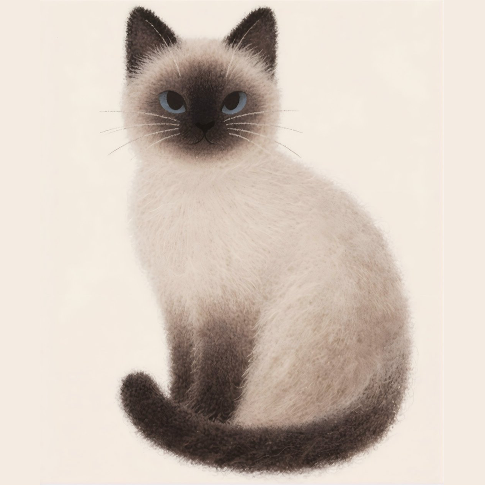

<div align="center">
  
  <h1>KelivoMeow</h1>

基于 [Kelivo](https://github.com/Chevey339/kelivo) 的个人定制版 —— 在原版之上加入技能系统与更细致的排版控制

</div>

---

## ✨ 定制功能

### 1. 三滑块字体缩放
在设置中提供三个独立滑块，分别控制**界面**、**聊天内容**、**输入框**的字体大小（绝对缩放，互不影响）。

### 2. 文本型 Skill 系统
- 支持将提示词封装为可复用的「技能」文件，在技能管理页统一导入 / 启用 / 绑定到助手
- 技能内容以 `system` 角色注入对话，模型可正确识别（而非被当作用户消息）
- 支持关键词隐式触发 + 助手显式绑定两种方式
- 技能内容密钥通过系统安全存储（keychain / credential vault）保护

### 3. Markdown 个性化渲染
「引用文字与正文同大」等排版开关，让引用块、正文按你的阅读习惯显示（默认开启）。

---

## 🔀 与上游的关系

```
Chevey339/kelivo（上游本体）
    └── PasleySage/kelivo（本仓库）
              └── feat/kelivomeow-skill 分支 = KelivoMeow 全部定制
```

- 除上述定制功能外，**不改动 Kelivo 核心实现**（聊天 / Provider / UI 架构保持原样），定制以「挂载子系统」的方式接入，便于跟随上游更新合流
- 上游发布新版本后，可将上游改动合并进本分支，定制功能以少量接入点（assistant 编辑页 tab、消息构建、l10n）为界，冲突面可控

## 💐 致谢

- [Chevey339/kelivo](https://github.com/Chevey339/kelivo) —— 本项目的一切基础，出色的开源 LLM 客户端
- [MuMu-0604/kelivo](https://github.com/MuMu-0604/kelivo)（Kelivo Plus）—— 感谢其技能（Skill）系统设计带来的灵感，本仓库的技能子系统受其启发并独立实现

## 📱 双端身份

KelivoMeow 与原版 Kelivo 可**同设备共存**，互不干扰：

| | 本体 Kelivo | KelivoMeow |
| --- | --- | --- |
| Android 显示名 | Kelivo | **KelivoMeow** |
| Android 包名 | `com.psyche.kelivo` | `com.psyche.kelivomeow` |
| Windows 可执行文件 | kelivo.exe | **KelivoMeow.exe** |
| 数据目录 | `com.psyche\kelivo` | `com.psyche\kelivomeow` |

## 🛠️ 构建

```bash
# Windows
flutter build windows --release

# Android（KelivoMeow 身份）
flutter build apk --release -PmeowTarget=kelivomeow
```

- Windows 构建依赖 Flutter Desktop 与 Rust 工具链（`super_native_extensions` 经 cargokit 编译）
- Android 构建依赖 JDK 21、NDK 28.2、Rust 的 `aarch64-linux-android` / `armeabi-v7a` / `x86_64-linux-android` 目标
- 详细的部署与上游合流流程见 [`deploy/`](deploy/) 目录

## 📄 License

沿用上游 [Kelivo](https://github.com/Chevey339/kelivo) 的开源协议。
